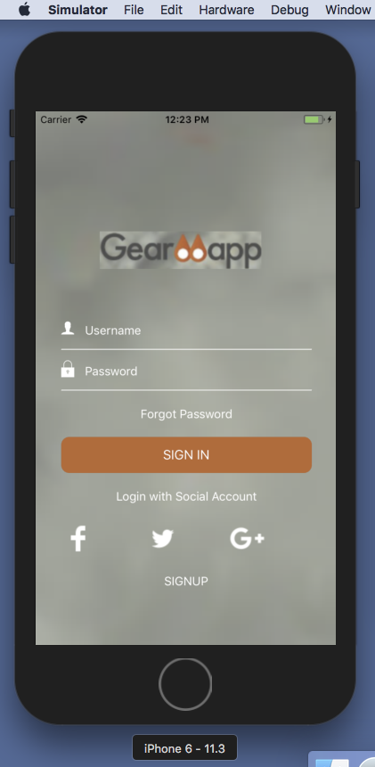
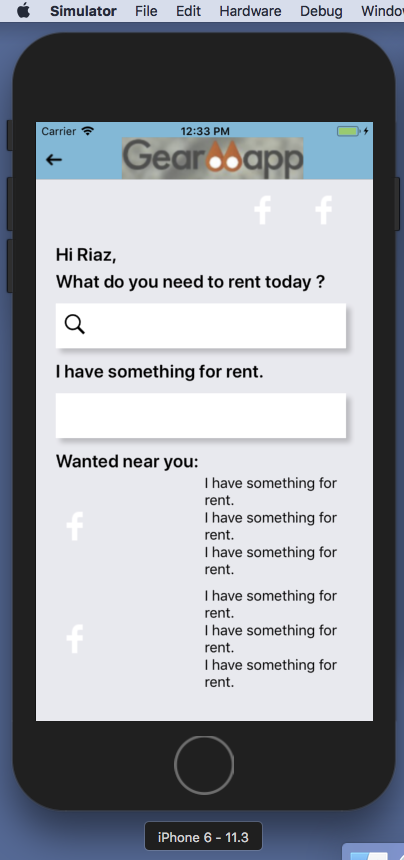

#GearMapp2

This is GearMapp2 App

#Screen Short
<p align="center">
    
</p>
<p align="center">
    
</p>

#Commends
```
exp://192.168.0.1:19000
```

Try opening Safari or Chrome on your phone and loading

```
http://192.168.0.1:19000
```

and

```
http://192.168.0.1:19001
```